# Awesome Real-Time Streaming Analytics ⚡



<a href="https://github.com/ishandutta2007/Awesome-Awesome-Awesome"></a><a href="https://discord.gg/jc4xtF58Ve"></a>
[](https://github.com/ishandutta2007/Awesome-Awesome-Awesome)
[](https://creativecommons.org/publicdomain/zero/1.0/)
[](https://github.com/ishandutta2007/Awesome-Real-Time-Streaming-Analytics/pulls)
<a href="https://github.com/ishandutta2007"></a>

> **The Definitive Ecosystem Guide to Real-Time Streaming Analytics, Continuous Event Processing (CEP), Streaming SQL, and Low-Latency OLAP Architecture.** 🚀

---

## 📌 Executive Overview & Market Analysis 📊

The **global real-time streaming analytics market** is estimated at **$20.5 Billion in 2026** 📈 and is projected to expand to **$52.4 Billion by 2030 at a 25.8% CAGR** 🚀. The market is currently **highly fragmented**, split between top cloud hyperscalers (Microsoft, Google, AWS), data lakehouse pioneers (Databricks, Confluent), and specialized low-latency streaming SQL & OLAP engines (StarTree, Decodable, RisingWave). 🔮

---

## 📑 Table of Contents 🧭

- [📌 Executive Overview & Market Analysis](#-executive-overview--market-analysis-)
- [🌐 Commercial & Managed SaaS Platforms](#-commercial--managed-saas-platforms-)
- [🔓 Open-Source Stream Processing Ecosystem](#-open-source-stream-processing-ecosystem-)
  - [⭐ Top Open-Source Projects (Ranked by Stars)](#-top-open-source-projects-ranked-by-stars)
- [🛠️ Architecture Decision Matrix](#%EF%B8%8F-architecture-decision-matrix-)
- [🔍 SEO & Keywords Glossary](#-seo--keywords-glossary-)
- [🤝 How to Contribute](#-how-to-contribute-)
- [📈 Star History](#-star-history)
- [💖 Support & Community](#-support--community)
- [⚖️ Disclaimer & Licensing](#%EF%B8%8F-disclaimer--licensing-)

---

## 🌐 Commercial & Managed SaaS Platforms ☁️

> 💡 **Market Fragmentation & Scale**: The managed stream processing sector remains **highly fragmented**, offering fully managed serverless infrastructure, sub-second continuous query engines, and turnkey SLAs without the burden of self-hosting cluster state managers.

*Platforms below are sorted by company scale (Valuation / Market Cap) in descending order:* 🔻

| Platform 🏢 | Scale (Valuation / Market Cap) 💰 | Starting Pricing 💵 | Free Tier / Trial Limit 🎁 | Core Strengths & Best For 🎯 |
| :--- | :--- | :--- | :--- | :--- |
| **[Azure Stream Analytics](https://azure.microsoft.com/en-us/products/stream-analytics/)** | **$3.1 Trillion** (Market Cap) | **$0.11 / Streaming Unit (SU) per hour** | **$200 credit for 30 days** + 12 months free popular services | SQL-based stream processing natively integrated with Event Hubs & Azure IoT. ⚡ |
| **[Google Cloud Dataflow](https://cloud.google.com/dataflow)** | **$2.1 Trillion** (Market Cap) | **$0.056 / vCPU-hr + $0.0074 / GB-hr** | **$300 credit for 90 days** across all GCP services | Serverless unified stream/batch processing based on Apache Beam. 🌐 |
| **[AWS Kinesis Data Analytics](https://aws.amazon.com/kinesis/data-analytics/)** | **$1.9 Trillion** (Market Cap) | **$0.11 / KPU-hour** (Kinesis Processing Unit) | **1 Million Kinesis records/mo free** in 12-month AWS Free Tier | Fully managed Apache Flink on AWS for zero-ops real-time pipelines. 📦 |
| **[Databricks Streaming](https://www.databricks.com/)** | **$43.0 Billion** (Valuation) | **$0.07 / DBU-hour** (Databricks Unit) | **14-day free trial** + **$300 cloud platform credits** | Delta Live Tables & Spark Structured Streaming for lakehouse analytics. 🧱 |
| **[Confluent Cloud](https://www.confluent.io/confluent-cloud/)** | **$7.5 Billion** (Market Cap) | **$0.10 / GB ingress + $0.015 / CKU-hr** | **$400 free credit** valid for 30 days | Enterprise Kafka with serverless Flink, ksqlDB, and governance. 🌊 |
| **[StarTree Cloud](https://startree.ai/)** | **$250 Million** (Valuation) | **$0.35 / node-hour** (BYOC Serverless) | **30-day free trial** with **$500 trial credits** | Managed Apache Pinot for real-time user-facing dashboards at scale. 🌲 |
| **[Decodable](https://www.decodable.co/)** | **$100 Million** (Valuation) | **$0.08 / task-hour** (Pay-As-You-Go) | **Developer Free Tier**: 50 task-hours/month forever | Serverless Flink & SQL pipelines for lightweight streaming ETL. 🧩 |
| **[Upsolver](https://www.upsolver.com/)** | **$80 Million** (Valuation) | **$0.09 / compute-unit hour** | **14-day free trial** with unlimited compute units | Automated stream-to-lakehouse ingestion and continuous SQL transforms. ⚙️ |
| **[DeltaStream](https://deltastream.io/)** | **$40 Million** (Valuation) | **$0.15 / SPU-hour** (Stream Processing Unit) | **14-day free trial** with **$200 trial credits** | Serverless streaming SQL platform for real-time Kafka & Pulsar topics. 💧 |

---

## 🔓 Open-Source Stream Processing Ecosystem 💻

Streaming analytics has one of the richest open-source ecosystems in software engineering. The projects below cover continuous stateful processing, streaming SQL, Change Data Capture (CDC), and real-time OLAP. 🔥

### ⭐ Top Open-Source Projects (Ranked by Stars)

*Projects are sorted by GitHub Star count in descending order. Star badges directly link to each repository's stargazers page:* 🌟

| Repository 📦 | GitHub Stars 🌟 | License 📜 | Category 🏷️ | Key Features & Highlights ⚡ |
| :--- | :--- | :--- | :--- | :--- |
| **[Apache Spark](https://github.com/apache/spark)** | [](https://github.com/apache/spark/stargazers) | Apache-2.0 | Engine | **Structured Streaming** with unified batch/stream DataFrame API & exactly-once semantics. ✨ |
| **[ClickHouse](https://github.com/ClickHouse/ClickHouse)** | [](https://github.com/ClickHouse/ClickHouse/stargazers) | Apache-2.0 | OLAP | Extremely fast columnar analytical database for continuous stream ingestion & sub-second queries. ⚡ |
| **[Apache Kafka](https://github.com/apache/kafka)** | [](https://github.com/apache/kafka/stargazers) | Apache-2.0 | Messaging | Distributed event streaming platform featuring **Kafka Streams** for lightweight in-app stream processing. 📡 |
| **[Apache Flink](https://github.com/apache/flink)** | [](https://github.com/apache/flink/stargazers) | Apache-2.0 | Engine | **De facto standard for stateful processing** — event-at-a-time, savepoints, and millisecond latency at scale. 🐿️ |
| **[Vector](https://github.com/vectordotdev/vector)** | [](https://github.com/vectordotdev/vector/stargazers) | MPL-2.0 | Pipeline | Ultra-fast Rust-based observability data pipeline for log, metric, and telemetry streaming. 🦀 |
| **[Logstash](https://github.com/elastic/logstash)** | [](https://github.com/elastic/logstash/stargazers) | Elastic 2.0 | Pipeline | Server-side data processing pipeline that ingests from multiple sources and transforms in real time. 🪵 |
| **[Apache Druid](https://github.com/apache/druid)** | [](https://github.com/apache/druid/stargazers) | Apache-2.0 | OLAP | High-performance real-time analytics database designed for fast slice-and-dice analytics on event streams. 🍇 |
| **[Fluentd](https://github.com/fluent/fluentd)** | [](https://github.com/fluent/fluentd/stargazers) | Apache-2.0 | Pipeline | Unified logging layer for continuous data collection and real-time log aggregation. 📄 |
| **[Apache Doris](https://github.com/apache/doris)** | [](https://github.com/apache/doris/stargazers) | Apache-2.0 | OLAP | High-performance, real-time analytical database supporting sub-second SQL queries over streaming data. 🐬 |
| **[Debezium](https://github.com/debezium/debezium)** | [](https://github.com/debezium/debezium/stargazers) | Apache-2.0 | CDC | Premier Change Data Capture (CDC) platform capturing database changes into real-time streams. 🔄 |
| **[Apache Beam](https://github.com/apache/beam)** | [](https://github.com/apache/beam/stargazers) | Apache-2.0 | Unified API | Portable programming model for stream/batch pipelines executed on Flink, Spark, or Dataflow. 💡 |
| **[Redpanda Connect](https://github.com/redpanda-data/connect)** | [](https://github.com/redpanda-data/connect/stargazers) | Apache-2.0 | Pipeline | High-performance, declarative stream processor with zero code requirements. 🐼 |
| **[StarRocks](https://github.com/StarRocks/starrocks)** | [](https://github.com/StarRocks/starrocks/stargazers) | Apache-2.0 | OLAP | Next-generation sub-second OLAP database designed for real-time analytics & lakehouse integration. 💫 |
| **[RisingWave](https://github.com/risingwavelabs/risingwave)** | [](https://github.com/risingwavelabs/risingwave/stargazers) | Apache-2.0 | Streaming DB | PostgreSQL-compatible streaming database with incremental materialized views stored on S3. 🌊 |
| **[Apache SeaTunnel](https://github.com/apache/seatunnel)** | [](https://github.com/apache/seatunnel/stargazers) | Apache-2.0 | Integration | High-performance, distributed data integration platform for streaming & batch synchronization. 🚇 |
| **[Apache Storm](https://github.com/apache/storm)** | [](https://github.com/apache/storm/stargazers) | Apache-2.0 | Engine | Distributed real-time computation system for fault-tolerant processing of fast data streams. 🌩️ |
| **[Apache Pinot](https://github.com/apache/pinot)** | [](https://github.com/apache/pinot/stargazers) | Apache-2.0 | OLAP | Distributed OLAP datastore designed for low-latency, high-throughput user-facing analytics. 🍷 |
| **[Fluent Bit](https://github.com/fluent/fluent-bit)** | [](https://github.com/fluent/fluent-bit/stargazers) | Apache-2.0 | Pipeline | Ultra-lightweight log and metric processor for cloud-native and edge streaming. 🪶 |
| **[Materialize](https://github.com/MaterializeInc/materialize)** | [](https://github.com/MaterializeInc/materialize/stargazers) | BSL-1.1 | Streaming DB | PostgreSQL-compatible operational data warehouse powered by Timely Dataflow. 👁️ |
| **[Apache NiFi](https://github.com/apache/nifi)** | [](https://github.com/apache/nifi/stargazers) | Apache-2.0 | Dataflow | Easy-to-use, powerful visual dataflow automation and streaming platform. 💧 |
| **[Arroyo](https://github.com/ArroyoSystems/arroyo)** | [](https://github.com/ArroyoSystems/arroyo/stargazers) | Apache-2.0 | Engine | Distributed Rust-based stream processing engine for SQL pipelines with low operational overhead. ⛰️ |
| **[Apache Samza](https://github.com/apache/samza)** | [](https://github.com/apache/samza/stargazers) | Apache-2.0 | Engine | State-preserving stream processing framework tightly integrated with Kafka and YARN. 🏹 |

---

## 🛠️ Architecture Decision Matrix 📐

```
                          ┌───────────────────────────┐
                          │   Real-Time Event Stream  │
                          └─────────────┬─────────────┘
                                        │
             ┌──────────────────────────┴──────────────────────────┐
             ▼                                                     ▼
┌─────────────────────────┐                               ┌─────────────────────────┐
│ Statefull Processing    │                               │ Real-Time OLAP Queries  │
│ (Flink, Beam, Spark)    │                               │ (ClickHouse, Pinot,     │
└────────────┬────────────┘                               │  Druid, StarRocks)      │
             │                                            └────────────┬────────────┘
             ▼                                                         ▼
┌─────────────────────────┐                               ┌─────────────────────────┐
│ Complex Event Logic /   │                               │ User-Facing Dashboards  │
│ Stream Join / Alerts    │                               │ Sub-Second Aggregations │
└─────────────────────────┘                               └─────────────────────────┘
```

1. **Stateful Stream Processing 🐿️**: Use **Apache Flink** or **Apache Beam** when sub-second latency, exact event-time windowing, and complex state management are required.
2. **Streaming SQL & Materialized Views 🌊**: Choose **RisingWave** or **Materialize** when you want PostgreSQL-compatible SQL over event streams with minimal ops.
3. **High-Throughput Real-Time OLAP 📊**: Select **ClickHouse**, **Apache Pinot**, or **Apache Druid** when serving interactive analytical dashboards directly to users.
4. **Change Data Capture (CDC) 🔄**: Deploy **Debezium** to convert traditional relational database changes into continuous Kafka events.

---

## 🔍 SEO & Keywords Glossary 📖

- **Continuous Queries**: Persistent SQL queries that continuously process live streams and update results incrementally as events arrive. 🔄
- **Complex Event Processing (CEP)**: Tracking and analyzing streams of events to identify complex patterns, correlations, and anomalies (e.g. fraud detection). 🎯
- **Stream Ingestion & Analytics**: Collecting high-velocity event data from Kafka/Kinesis and computing real-time KPIs with millisecond latency. ⚡
- **Sub-Second Latency**: Processing events and executing analytical queries in less than one second. ⏱️
- **Stateful Processing**: Preserving contextual state across event streams for windowing, sessionization, and exact stream joins. 🧠

---

## 🤝 How to Contribute 🛠️

1. Fork this repository. 🍴
2. Add your entry following the structured Markdown table format. 📝
3. Ensure all links are active and pricing details are strictly up to date. 🔗
4. Submit a Pull Request (PR) with a brief summary of additions. 🚀

---

## 📈 Star History

[](https://star-history.dera.page/#ishandutta2007/Awesome-Real-Time-Streaming-Analytics&type=date&legend=top-left)

---

## 💖 Support & Community

If you find this repository helpful, please consider supporting the project! 🙌

- **Star ⭐️**: Click the star button at the top right to boost visibility!
- **Fork 🍴**: Fork the repo to contribute new platforms or open-source projects.
- **Share 📢**: Share with your data engineering and real-time streaming community.
- **Sponsor ☕**: Support the author by sponsoring or buying a coffee via [GitHub Sponsors Dashboard](https://github.com/sponsors/ishandutta2007).

---

## ⚖️ Disclaimer & Licensing 📜

- This list is **community-curated** for architectural research and education. 🎓
- All brand names, logos, and trademarks belong to their respective owners. 🏷️
- Open-source licenses vary (Apache-2.0, BSL, MPL-2.0). Verify licensing prior to commercial deployment. 🔒
